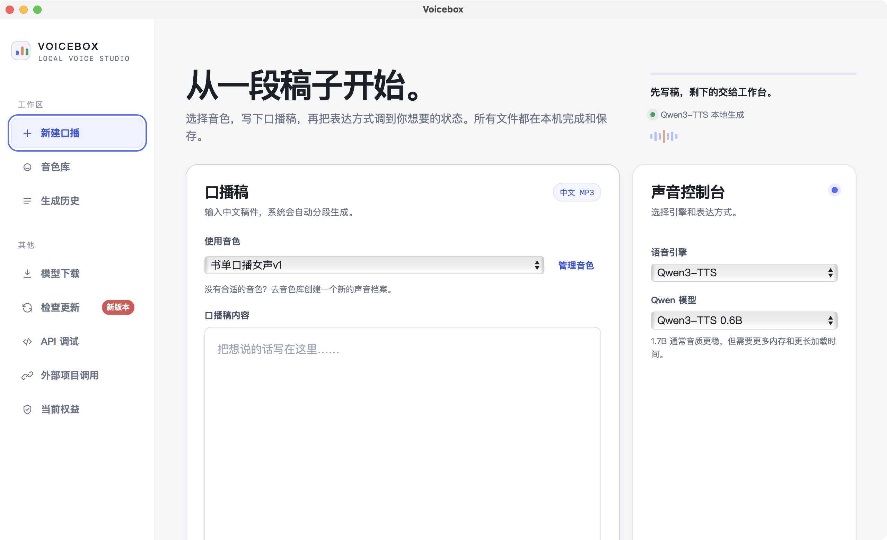
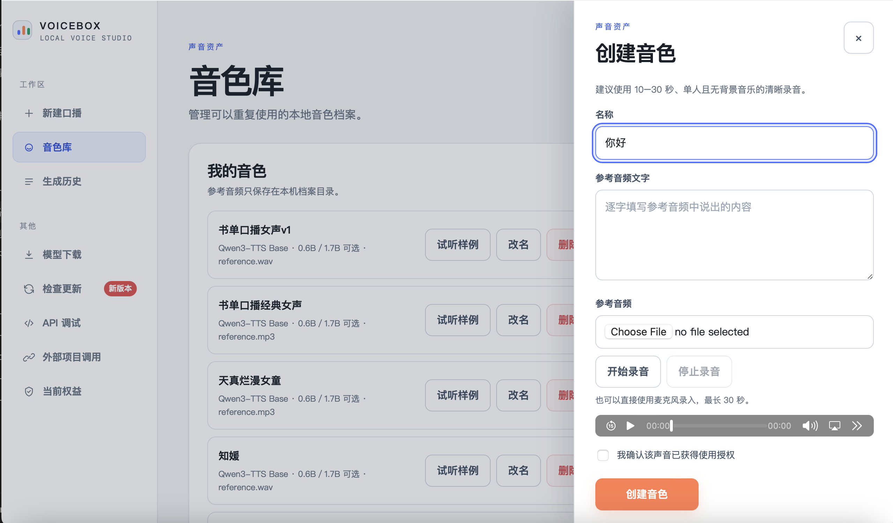
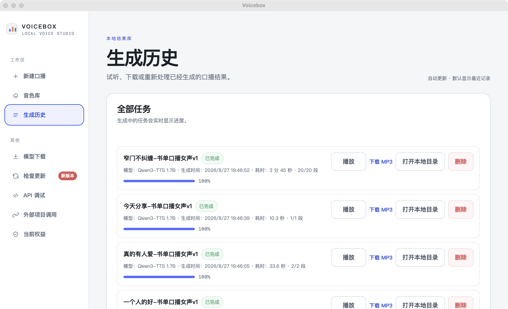
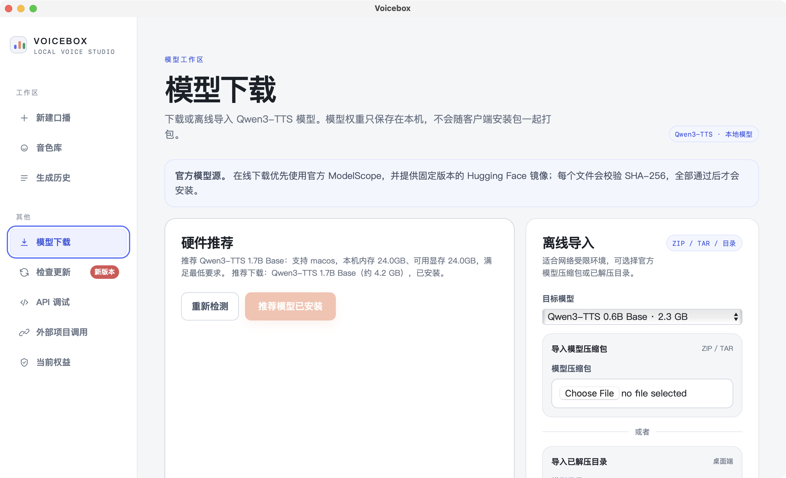
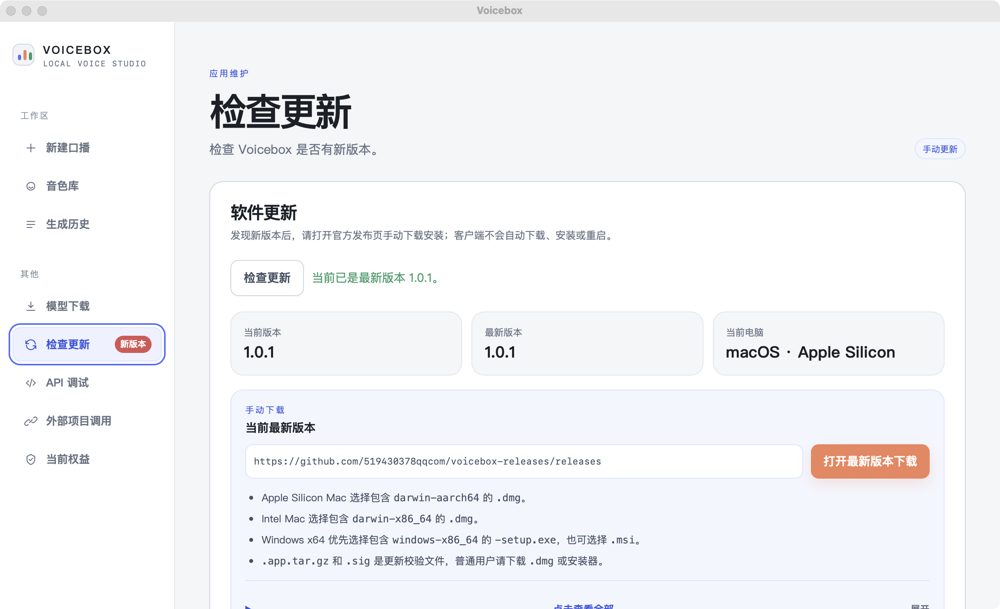
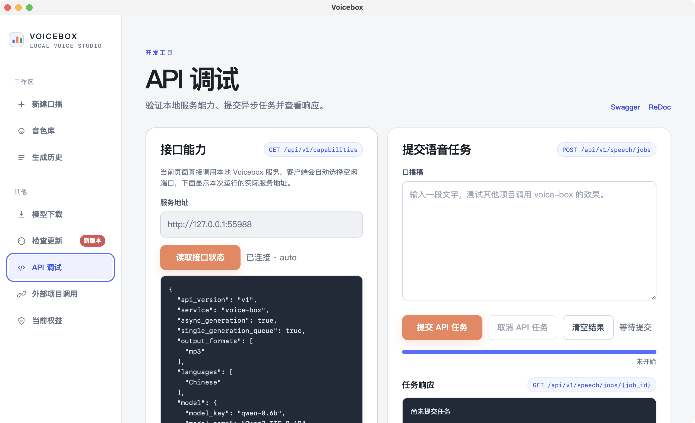
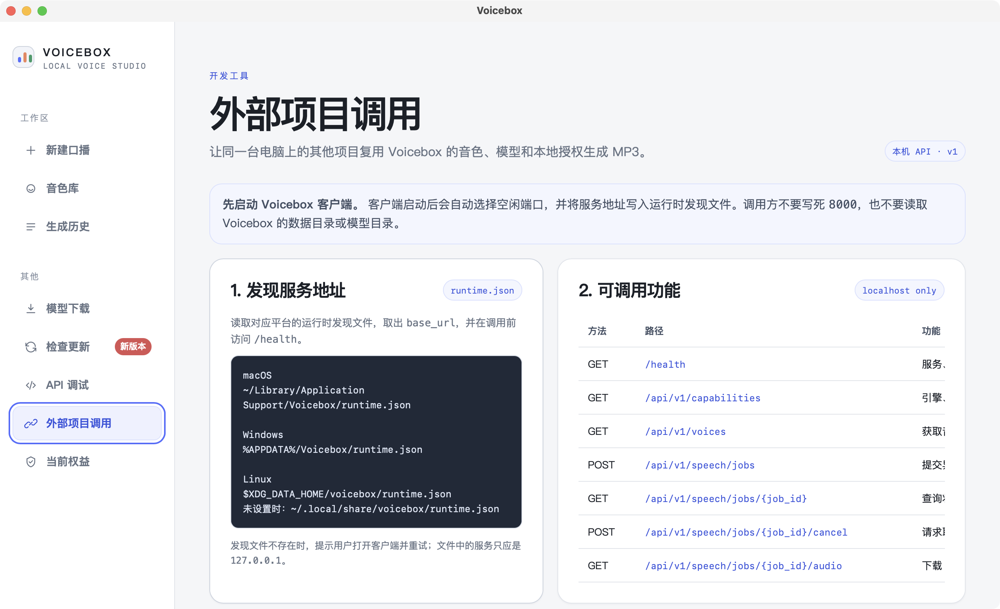

# Voicebox

Voicebox 是一款本地中文口播与音色克隆桌面工具。发行客户端已内置按平台准备的 FFmpeg 音频转换组件，创建音色和导出 MP3 无需用户另行安装 FFmpeg。

[下载与安装说明](./下载说明.md) · [最新版本下载](https://github.com/519430378qqcom/voicebox-releases/releases) · [阿里云 Qwen 参考音色库](https://help.aliyun.com/zh/model-studio/qwen-tts-voice-list)

## 产品简介

Voicebox 可以在本机创建可重复使用的音色档案，输入中文口播稿并生成 MP3。稿件、音色档案、生成历史和音频默认保存在本机。

## 支持平台

当前官方安装包支持 macOS Apple Silicon、macOS Intel 和 Windows x64；Windows ARM64 与 Linux 当前暂不支持，具体文件选择见[下载与安装说明](./下载说明.md)。

## 下载说明

常用安装包选择如下：

- Apple Silicon Mac 选择包含 `darwin-aarch64` 的 `.dmg`。
- Intel Mac 选择包含 `darwin-x86_64` 的 `.dmg`。
- Windows x64 优先选择包含 `windows-x86_64` 的 `-setup.exe`，也可选择 `.msi`。
- `.app.tar.gz` 和 `.sig` 是更新校验文件，普通用户请下载 `.dmg` 或安装器。

点击查看全部

<!-- DOWNLOAD_GUIDE_BEGIN -->
# Voicebox 客户端下载说明

请先打开官方发布页：

<https://github.com/519430378qqcom/voicebox-releases/releases>

在页面中选择最新版本，再根据自己的操作系统和 CPU 架构下载对应的**手动安装包**。

## 下载选择

| 系统 | 如何判断 | 应下载的文件 | 当前发布状态 |
| --- | --- | --- | --- |
| macOS Apple Silicon | “关于本机”显示芯片为 Apple M 系列；终端 `uname -m` 返回 `arm64` | 文件名包含 `darwin-aarch64`，并以 `.dmg` 结尾 | 支持 |
| macOS Intel | “关于本机”显示处理器为 Intel；终端 `uname -m` 返回 `x86_64` | 文件名包含 `darwin-x86_64`，并以 `.dmg` 结尾 | 支持 |
| Windows x64 | 设置 → 系统 → 系统信息 → 系统类型显示“基于 x64 的处理器” | 优先选择文件名包含 `windows-x86_64` 且以 `-setup.exe` 结尾的文件；也可以选择对应 `.msi` | 支持 |
| Windows ARM64 | 系统类型显示 ARM64 | 当前没有专用 ARM64 安装包，请等待发布 ARM64 版本 | 暂不支持 |
| Linux | 任意 Linux 发行版 | 当前没有官方 Linux 安装包 | 暂不支持 |

## 当前版本示例

当前发布页中的 `v1.0.0` 文件名可能类似以下形式：

- Apple Silicon：`Voicebox_1-1.0.0-darwin-aarch64...aarch64.dmg`
- Intel Mac：`Voicebox_1-1.0.0-darwin-x86_64...x64.dmg`
- Windows x64：`Voicebox_1-1.0.0-windows-x86_64...x64-setup.exe`
- Windows x64 备用安装格式：对应的 `.msi` 文件

版本升级后，文件名中的版本号会变化，请以发布页中最新版本为准，不要机械照抄上面的 `1.0.0`。

## 文件类型说明

- macOS 手动安装请选择 `.dmg`，打开后将 Voicebox 拖入“应用程序”。
- Windows 手动安装优先选择 `-setup.exe`；如果单位环境限制 EXE 安装，也可以使用 `.msi`。
- `.app.tar.gz` 和 `.sig` 是更新校验文件，普通用户请下载 `.dmg` 或安装器。
- `.sig` 是更新签名文件，不能单独打开或安装。

## 下载后打不开怎么办

1. 确认系统和 CPU 架构匹配，不要在 Intel Mac 上下载 `darwin-aarch64`，也不要在 Apple Silicon Mac 上下载 `darwin-x86_64`。
2. 如果 GitHub 大文件下载超时，先打开发布页再重新点击对应附件，或更换可以访问 GitHub Release 资源的网络。
3. macOS 首次打开如果提示无法验证开发者，请确认下载来源确实是上面的官方发布页，再在“系统设置 → 隐私与安全性”中允许打开。
<!-- DOWNLOAD_GUIDE_END -->

## 主要功能

以下截图来自当前 macOS Apple Silicon 安装版，展示客户端各个 Tab 的实际界面。

### 新建口播

输入中文口播稿，选择本地音色和 Qwen3-TTS 模型，生成 WAV 中间文件并导出 MP3；声音控制台集中展示当前模型与生成参数。

### 音色库

管理可以重复使用的本地音色档案，支持创建、试听、改名和删除；创建音色时可以上传参考音频或进行现场录音。

### 生成历史

集中查看生成任务与进度，完成后可以播放、下载 MP3、打开本地目录或删除记录；失败任务支持重试，排队中的任务支持取消。

### 模型下载

根据本机硬件给出模型建议，支持在线下载 Qwen3-TTS 或从 ZIP、TAR、TAR.GZ、TGZ 和已解压目录离线导入，并在安装前校验模型文件。

### 检查更新

查看当前版本、最新版本、电脑平台和对应的下载入口。客户端不会自动下载、安装或重启，发现新版本后由用户手动安装。

### API 调试

直接在客户端验证本地 Voicebox 服务，查看接口能力、提交异步语音任务并读取任务响应，便于集成前快速排查调用链路。

### 外部项目调用

为同一台电脑上的其他项目提供本地 API 使用说明，包括运行时服务地址发现、健康检查、可调用接口和任务流程。

当前发行客户端暂不开放 CosyVoice 3，仅开放 Qwen3-TTS。

## 快速开始

1. 打开[下载与安装说明](./下载说明.md)，按系统和 CPU 架构下载手动安装包。
2. 启动 Voicebox，在“模型下载”中下载推荐的 Qwen3-TTS 0.6B；模型权重不随安装包提供。
3. 在“音色库”选择一个内置音色，或创建自己的音色档案。
4. 在“新建口播”输入中文稿件并生成，完成后试听或下载 MP3。

首次启动时，客户端会先等待本地服务准备完成，并显示加载状态；模型首次加载或切换模型时也可能需要一些时间。

## 音色库

发行包首次使用时提供五个内置音色：经典直播女、优雅知性女、思维灵动女、经典猴哥、天真烂漫女童。这些本地音色可以改名和删除。

创建自己的音色时，可以上传音频或现场录音，现场录音最长 30 秒。建议使用 10–30 秒、单人、清晰且无背景音乐的录音，并逐字填写参考文字；只使用本人或已获授权的声音。

你可以打开[阿里云 Qwen 官方音色列表](https://help.aliyun.com/zh/model-studio/qwen-tts-voice-list)作为选音和表达风格参考，但网页音色不会自动变成客户端内置音色。

## 模型下载

Qwen3-TTS 0.6B 适合先验证生成链路，Qwen3-TTS 1.7B 通常需要更多内存和更长加载时间。模型权重不随安装包提供；在线下载优先使用官方 ModelScope，并提供 Hugging Face 镜像，也支持 ZIP、TAR、TAR.GZ、TGZ 或已解压目录离线导入。模型文件会完成校验后才安装。

模型下载工作区会根据本机硬件给出推荐。第一次使用建议先安装 0.6B，确认可以正常生成后，再尝试 1.7B。

## 生成口播与生成历史

系统会对中文稿件分段，生成 WAV 中间文件并导出 MP3。历史页支持播放、下载、打开本地目录、失败重试、取消排队／生成中的任务和删除已完成记录；删除本地生成记录不可恢复。

发行客户端当前使用 Qwen3-TTS Base 音色克隆流程。生成任务共用本机模型和生成队列，同一时间只处理一个生成任务。

## 检查更新

进入“检查更新”可以查看当前版本、最新版本、当前电脑平台和对应下载地址。客户端启动后会向 GitHub Release 查询最新版本；发现新版本时，“检查更新”旁会显示红色“新版本”提示。客户端不会自动下载、安装或重启，请打开页面中的最新版本下载入口手动安装。

也可以直接打开[最新版本下载页](https://github.com/519430378qqcom/voicebox-releases/releases)选择适合当前电脑的安装包。平台、CPU 架构和文件类型的具体选择请以[下载与安装说明](./下载说明.md)为准。

## 隐私与安全

口播稿、参考音频和生成文件默认在本机处理与保存；模型下载和软件更新需要联网。使用数据上报是否启用由发行配置决定，启用时只发送设备基础信息和使用汇总，不发送口播稿、参考音频或生成文件；页面不提供上报状态入口。

本机服务只监听 `127.0.0.1`，不要将本地 API 端口暴露到公网；授权仅绑定当前设备。只使用本人或获得授权的声音，并遵守相关法律、平台规则和 AI 生成内容披露要求。

## 常见问题

- 模型未下载或下载失败：进入“模型下载”，重新检查推荐结果，或使用官方模型压缩包／已解压目录离线导入。
- macOS 无法打开：确认安装包来自[官方发布页](https://github.com/519430378qqcom/voicebox-releases/releases)，再按[下载与安装说明](./下载说明.md)中的系统设置步骤操作。
- GitHub 大文件下载超时：重新打开官方发布页下载，或更换可以访问 GitHub Release 资源的网络。
- 启动较慢：首次启动需要准备本地服务；首次加载模型还需要读取模型文件，等待加载状态完成即可。
- 版本检查超时：使用“检查更新”页面显示的当前电脑对应下载地址手动安装。
